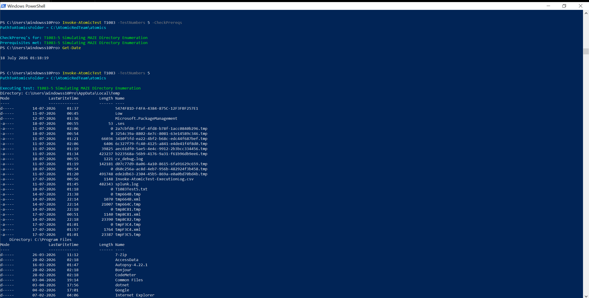
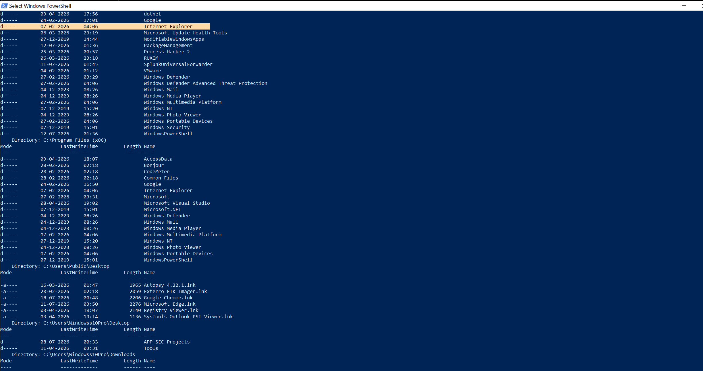
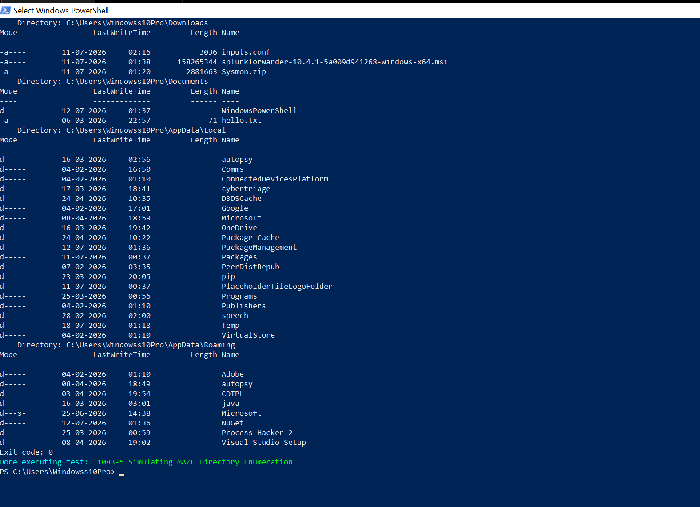

# Atomic Test Execution -- T1083-5

## Step 1 -- Review the Atomic Test

Before executing any Atomic test, understand exactly what it will do.

On **WIN10-01**, open an elevated PowerShell session and run:

```powershell
Invoke-AtomicTest T1083 -ShowDetails -TestNumbers 5
```

Test #5, "Simulating MAZE Directory Enumeration," runs a PowerShell script that loops over a
fixed set of common folders -- Desktop, Downloads, Documents, and the two AppData
subfolders -- for every user profile on the box, plus `Program Files` and
`Program Files (x86)` at the root. Every result gets appended to a temp file
(`%TEMP%\T1083Test5.txt`), and at the end the script just `cat`s that file out to the
console. It's a simple script, but the shape of it (loop, enumerate, swallow errors, append
output) is representative of a lot of real discovery tooling, not just this one test.

Confirm the following before proceeding:

- Test Name
- Description
- Executor
- Supported Platforms
- Command to be executed
- Input Arguments
- Dependencies
- Cleanup Commands

Do **not** execute the test yet -- read and understand it first.

## Step 2 -- Verify Prerequisites

Check whether the test requires any dependencies.

```powershell
Invoke-AtomicTest T1083 `
  -TestNumbers 5 `
  -CheckPrereqs
```

- If all prerequisites are satisfied, continue.
- If any prerequisite is missing, install it:

```powershell
Invoke-AtomicTest T1083 `
  -TestNumbers 5 `
  -GetPrereqs
```

Then run `-CheckPrereqs` again to confirm everything is ready.

> Test #5 has no external dependencies, but running `-CheckPrereqs` anyway keeps the process
> consistent and auditable across every technique in this lab, whether or not it's strictly
> needed for a given test.

## Step 3 -- Record the Start Time

This is extremely useful later when correlating telemetry.

```powershell
Get-Date
```

Example: `18 July 2026 01:18:19`

Record the timestamp before execution.

## Step 4 -- Execute

```powershell
Invoke-AtomicTest T1083 -TestNumbers 5
```

**Execution record:**

| Field | Value |
|---|---|
| Command | `Invoke-AtomicTest T1083 -TestNumbers 5` |
| Prereq check | Prerequisites met -- T1083-5 Simulating MAZE Directory Enumeration |
| Start time | 01:18:19 on 18 July 2026 |
| Host | WIN10-01 |



The script ran in seconds and dumped its own findings straight to the console via the final
`cat` command -- a nice sanity check that the enumeration actually worked, on top of whatever
shows up in the logs afterward:




Windows generated multiple events tied to this PowerShell execution within seconds -- these
were collected from Event Viewer and later verified in Splunk. See
[`03-telemetry-validation.md`](03-telemetry-validation.md) and
[`04-splunk-validation.md`](04-splunk-validation.md).
