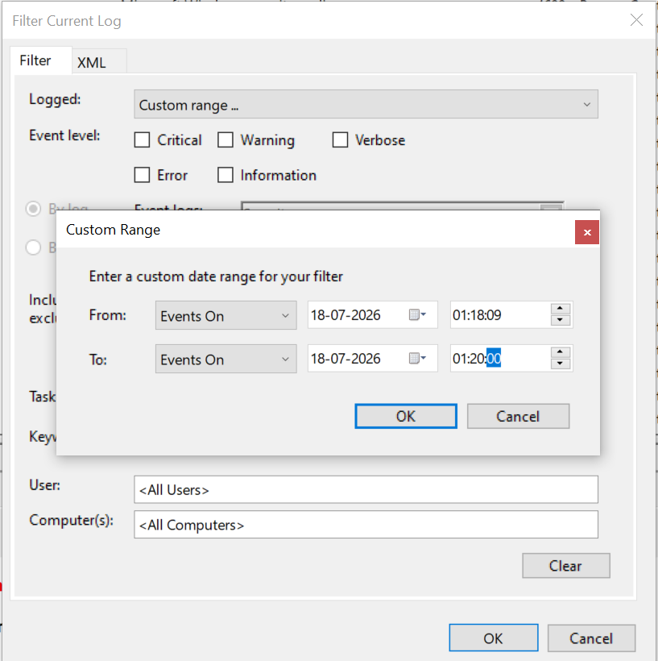
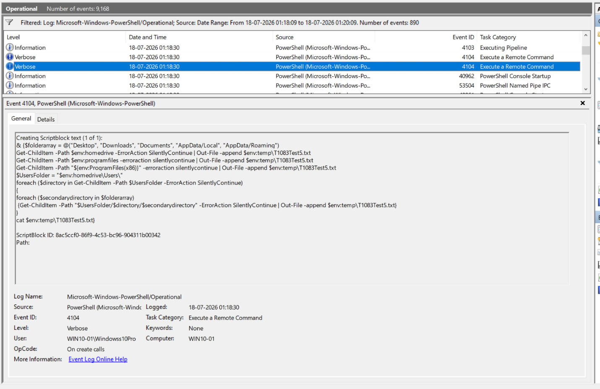
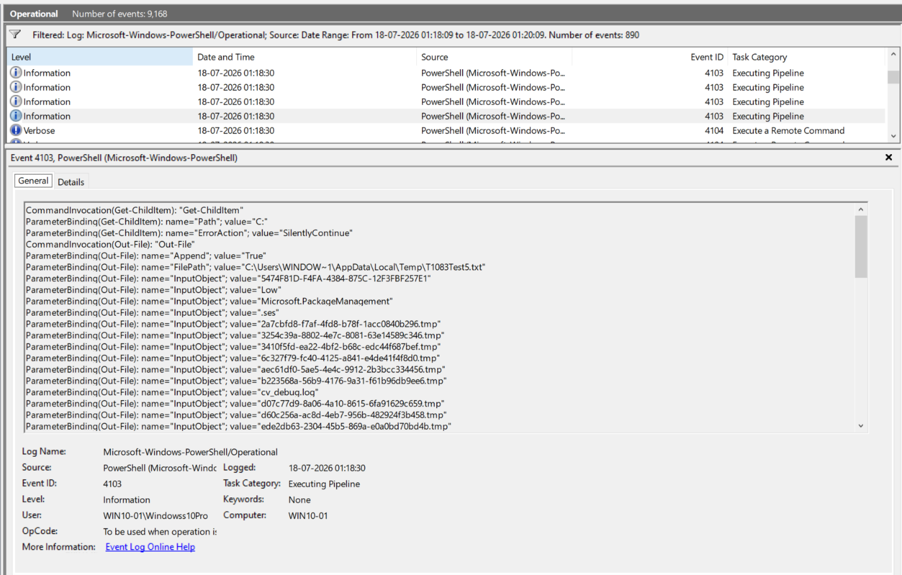
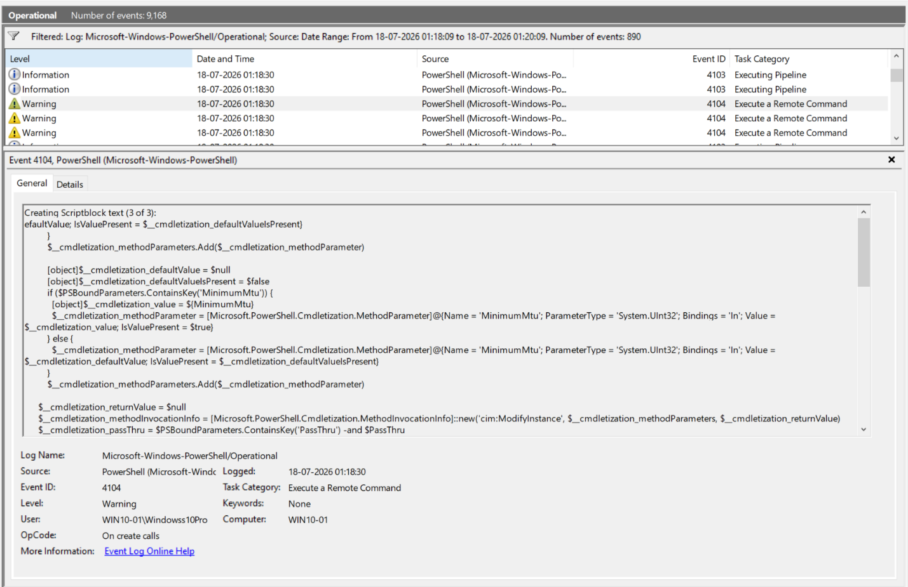
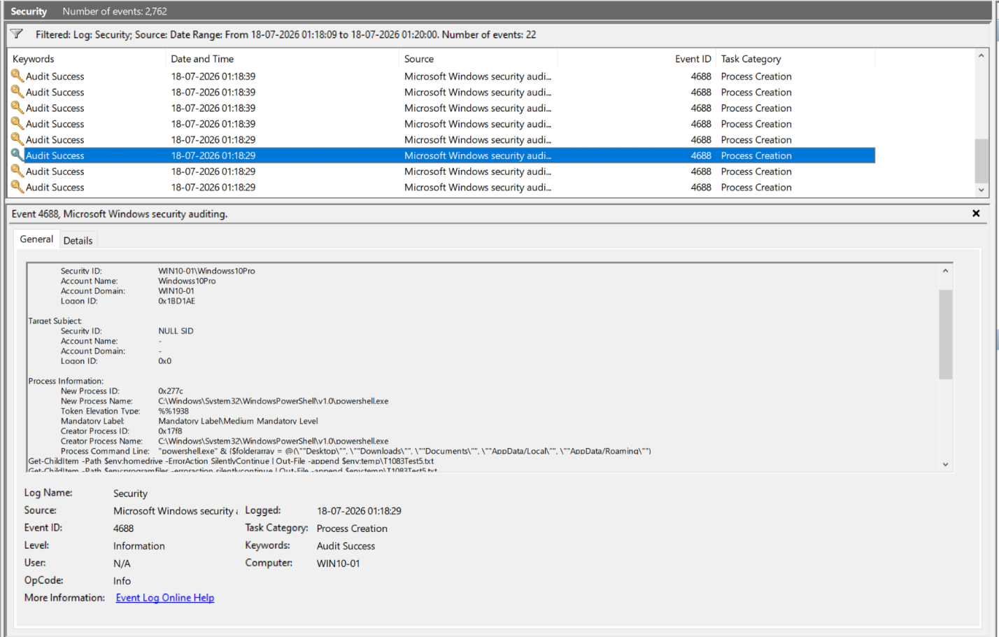
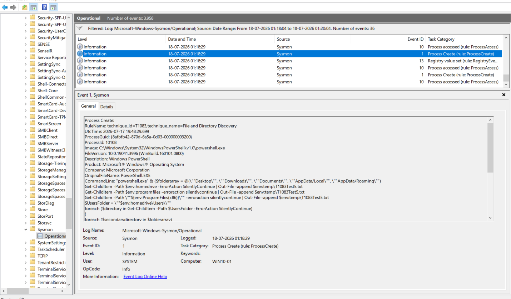

# Telemetry Validation -- T1083

To validate directory enumeration telemetry, Atomic Red Team test **T1083-5 -- Simulating MAZE
Directory Enumeration** was executed:

```powershell
Invoke-AtomicTest T1083 -TestNumbers 5
```

Execution began at approximately **01:18:29 on 18 July 2026**. Within the same second, Windows
generated events across three separate log sources -- PowerShell Operational, Security, and
Sysmon. These were collected from Event Viewer and later verified in Splunk (see
[`04-splunk-validation.md`](04-splunk-validation.md)).

Since the PowerShell Operational log fills up fast even on an idle box, **Filter Current Log**
was used to narrow the search to the execution window, rather than scrolling through hundreds
of unrelated entries:



---

## 1. PowerShell Script Block Logging (Event ID 4104)

**Navigation:**
`Event Viewer → Applications and Services Logs → Microsoft → Windows → PowerShell → Operational`

The `Microsoft-Windows-PowerShell/Operational` log records PowerShell activity, including
executed cmdlets and script block content. Since the MAZE directory enumeration test runs
entirely inside PowerShell, this log gives the clearest picture of what actually executed.

Event ID **4104** records the PowerShell code itself, after the engine has parsed it -- not
just the process that launched it. That makes it one of the most valuable sources for
detecting PowerShell-based discovery, because it survives things like renamed binaries or
obfuscated one-liners that would otherwise hide the intent from a process-creation log alone.



The recovered script block matches the Atomic Red Team test almost verbatim: a `foreach` loop
walking every user's Desktop, Downloads, Documents, and AppData folders, plus `Program Files`
and `Program Files (x86)`, with every `Get-ChildItem` call wrapped in
`-ErrorAction SilentlyContinue` and its output appended to `%TEMP%\T1083Test5.txt`.

Key fields recovered:

| Field | Value |
|---|---|
| EventID | 4104 |
| TimeCreated | 2026-07-18T01:18:30 |
| Computer | WIN10-01 |
| ScriptBlockText | Directory-enumeration script (`foreach` + `Get-ChildItem` + `-ErrorAction SilentlyContinue` + `Out-File -append`) |

---

## 2. PowerShell Module Logging (Event ID 4103)

Using the same filtered window, the corresponding **4103** event sits right alongside the
4104 entry above.

Where 4104 captures the script as a whole, Event ID **4103** breaks it down cmdlet by cmdlet
-- recording each individual command invocation and the exact parameters bound to it. That
level of detail is useful for confirming *how* a script ran, not just *that* it ran.



Key fields recovered:

| Field | Value |
|---|---|
| EventID | 4103 |
| Command Name | `Get-ChildItem`, `Out-File` |
| Parameters observed | `-Path` (per folder), `-ErrorAction SilentlyContinue`, `-Append`, `-FilePath %TEMP%\T1083Test5.txt` |
| User | WIN10-01\Windowss10Pro |

**A quick note on log noise:** the PowerShell Operational log during this window wasn't
perfectly clean -- browsing a couple of entries either side of the test turned up an
unrelated 4104 event carrying a fragment of a completely different script block (something
tied to PSReadLine/cmdletization internals, not this test):



Worth calling out, because it's a small preview of why "match on any 4104 event" is not a
detection strategy on its own -- real PowerShell logging is noisy, and the eventual Sigma rule
in [`05-evidence.md`](05-evidence.md) has to be specific enough to survive that noise.

---

## 3. Process Creation (Windows Security Event ID 4688)

**Navigation:** `Event Viewer → Windows Logs → Security`

The Security log was filtered to the same execution window to identify the process behind
the enumeration.

Event ID **4688 -- A New Process Has Been Created** records every new process along with
Subject User, Parent Process, Newly Created Process, and Command Line.



Key fields recovered from the XML view:

| Field | Value |
|---|---|
| EventID | 4688 |
| SubjectUserName | Windowss10Pro |
| NewProcessName | `C:\Windows\System32\WindowsPowerShell\v1.0\powershell.exe` |
| NewProcessId | 10108 |
| ParentProcessName | `C:\Windows\System32\WindowsPowerShell\v1.0\powershell.exe` |
| TokenElevationType | %%1938 (limited/non-elevated token) |
| CommandLine | Directory-enumeration script (same as recovered in Event ID 4104) |

**Observation:** the new PowerShell process (PID 10108) was itself spawned from another
PowerShell process (PID 6136), which lines up with how `Invoke-AtomicTest` actually runs its
tests -- it launches the test's PowerShell payload from inside its own PowerShell session,
rather than from `cmd.exe`. The `TokenElevationType` value confirms the whole thing ran under
a standard, non-administrative token -- this kind of discovery doesn't need elevated
privileges to be useful to an attacker.

---

## 4. Process Creation (Sysmon Event ID 1)

**Navigation:**
`Event Viewer → Applications and Services Logs → Microsoft → Windows → Sysmon → Operational`

Sysmon extends the native Windows process-creation event with metadata that Security 4688
simply doesn't carry: Process GUID, file hashes, integrity level, current directory, and full
parent-process command line.



Key fields recovered from the XML view:

| Field | Value |
|---|---|
| EventID | 1 |
| RuleName | `technique_id=T1083,technique_name=File and Directory Discovery` |
| Image | `C:\Windows\System32\WindowsPowerShell\v1.0\powershell.exe` |
| OriginalFileName | `PowerShell.EXE` |
| ProcessGuid | `{8afbfb42-870d-6a5a-0d03-000000003200}` |
| ProcessId | 10108 |
| User | WIN10-01\Windowss10Pro |
| IntegrityLevel | Medium |
| CurrentDirectory | `C:\Users\WINDOW~1\AppData\Local\Temp\` |
| ParentImage | `C:\Windows\System32\WindowsPowerShell\v1.0\powershell.exe` |
| ParentCommandLine | `"...\powershell.exe" -ExecutionPolicy Bypass` |
| Hashes | SHA1 / MD5 / SHA256 / IMPHASH recorded for the executable |

**Observation:** the `RuleName` field is worth pointing out on its own -- this lab's Sysmon
configuration tags process-creation events with the matching MITRE ATT&CK technique ID at
ingest time, so this event was labeled `T1083` before any Sigma rule or SPL query ever ran
against it. That's a helpful sanity check, but it's the lab config doing the tagging, not a
detection -- the Sigma rule built in [`05-evidence.md`](05-evidence.md) still has to stand on
its own, matching on the script's actual behavior rather than relying on that label being
there.

Sysmon's Process GUID and hash set also make it straightforward to pivot from this single
event to everything else this process touched, which is exactly the kind of correlation
Security 4688 alone can't offer.

## Conclusion

All expected log sources -- PowerShell Operational (4104, 4103), Windows Security (4688), and
Sysmon (Event ID 1) -- successfully captured the Atomic Red Team execution, and every source
agrees on the same process (PID 10108, spawned from PID 6136). This confirms Detection
Objective #1 (*"Did Windows generate the expected telemetry?"*) from
[`01-hypothesis.md`](01-hypothesis.md).

Next: [`04-splunk-validation.md`](04-splunk-validation.md) confirms ingestion into Splunk.
