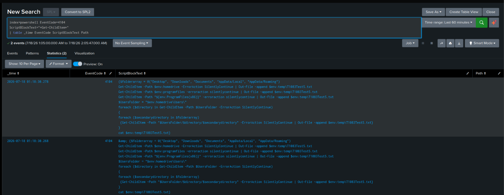
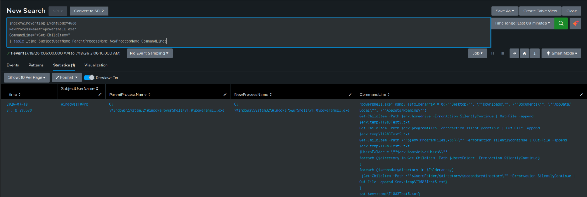
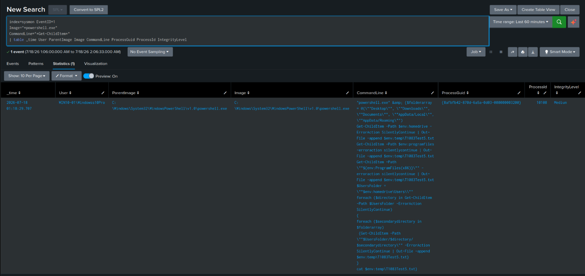

# Splunk Validation -- T1083

After confirming the events in Event Viewer, the same activity was validated in Splunk to
make sure it had actually made it through the Universal Forwarder. Three data sources were
checked: PowerShell Operational, Windows Security, and Sysmon.

## Query 1 -- Verify PowerShell Script Block Logging

**Purpose:** confirm Event ID 4104 was ingested into the `powershell` index and contains the
enumeration script.

```spl
index=powershell EventCode=4104
ScriptBlockText="*Get-ChildItem*"
| table _time EventCode ScriptBlockText Path
```



**Observation:** the search returned the Event ID 4104 record captured during the test, with
`ScriptBlockText` preserving the full enumeration script -- the `foreach` loop, the folder
list, and the `Get-ChildItem` calls are all readable straight out of the field. Filtering on
`Get-ChildItem` was enough on its own to isolate this event from the rest of the day's
PowerShell noise, which is a good early sign that this cmdlet is worth building the actual
Sigma rule around.

---

## Query 2 -- Verify Process Creation (Windows Security Log)

**Purpose:** confirm Event ID 4688 was ingested into the `wineventlog` index and recorded the
same PowerShell process.

```spl
index=wineventlog EventCode=4688
NewProcessName="*powershell.exe"
CommandLine="*Get-ChildItem*"
| table _time SubjectUserName ParentProcessName NewProcessName CommandLine
```



**Observation:** one matching event, confirming `Windowss10Pro` launched a new
`powershell.exe` process from a parent `powershell.exe` process, with the same enumeration
command line seen in Event Viewer. This matches the `Invoke-AtomicTest` behavior noted in
[`03-telemetry-validation.md`](03-telemetry-validation.md) -- the test spawns its payload from
inside an existing PowerShell session, not from `cmd.exe`.

---

## Query 3 -- Verify Sysmon Process Creation

**Purpose:** confirm Sysmon Event ID 1 was ingested into the `sysmon` index with its richer
process metadata intact.

```spl
index=sysmon EventID=1
Image="*powershell.exe"
CommandLine="*Get-ChildItem*"
| table _time User ParentImage Image CommandLine ProcessGuid ProcessId IntegrityLevel
```



**Observation:** one matching Sysmon event, carrying the same Process ID (10108), Process
GUID, and Integrity Level (`Medium`) already confirmed against the raw Event Viewer XML. The
consistency across all three sources -- same PID, same command line, same user -- is exactly
what you want to see before building a detection on top of any one of them.

## Conclusion

All expected indexes (`powershell`, `wineventlog`, `sysmon`) correctly ingested the telemetry
generated by the Atomic Test. This confirms Detection Objectives #2 and #3 from
[`01-hypothesis.md`](01-hypothesis.md).

Next: [`05-evidence.md`](05-evidence.md) covers Sigma rule development and the Sigma → SPL
conversion.
