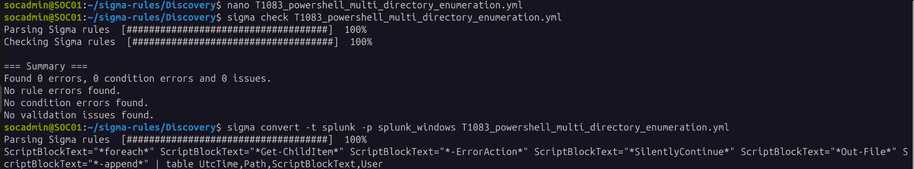
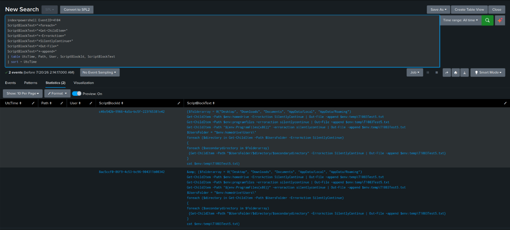

# Detection Evidence -- Sigma Rule Development & SPL Conversion (T1083)

## 4.1 Objective

Build a Sigma rule that catches PowerShell-based file and directory discovery consistent with
MITRE ATT&CK T1083, using the behavior demonstrated in Atomic Red Team T1083 Test #5
("Simulating MAZE Directory Enumeration") -- without leaning on artifacts that only exist
because it happened to be Atomic Red Team running it, like the specific temp filename or test
GUIDs it generates.

## 4.2 Evidence Used

| Evidence Source | Purpose |
|---|---|
| PowerShell Operational (Event ID 4104) | Recovered the complete enumeration script, not just the process that launched it |
| PowerShell Operational (Event ID 4103) | Confirmed cmdlet-level invocation and parameter binding |
| Security Event ID 4688 | Validated process creation and command-line arguments |
| Sysmon Event ID 1 | Captured detailed process creation telemetry, including parent process, integrity level, and hashes |
| Splunk Correlation | Verified consistent detection artifacts across all three log sources |

Of these, Event ID 4104 gave the clearest picture of what actually ran -- the full script
text, not just the process that launched it -- so it's the primary source the detection logic
is built on.

## 4.3 Detection Artifacts

Going through the telemetry, six things showed up consistently and described the *shape* of
the enumeration script, rather than any one-off detail of this particular test run:

| # | Artifact | Why it matters |
|---|---|---|
| 1 | `foreach` | The script loops over folders/users rather than checking a single path |
| 2 | `Get-ChildItem` | The actual enumeration cmdlet |
| 3 | `-ErrorAction` | Error handling is explicitly set, not left to default |
| 4 | `SilentlyContinue` | Errors are deliberately swallowed so the loop doesn't stop on a missing folder |
| 5 | `Out-File` | Results are written out rather than just printed to console |
| 6 | `-append` | Output accumulates across every iteration of the loop, into one file |

None of these depend on the temp filename Atomic Red Team happens to use, so they should hold
up against a real MAZE-style script and not just this specific simulation.

## 4.4 Detection Logic

The rule targets PowerShell Script Block Logging (Event ID 4104) and looks for all six
artifacts above showing up together, inside the same script block:

- **A `foreach` loop**
- **A call to `Get-ChildItem`**
- **`-ErrorAction`**
- **`SilentlyContinue`**
- **Output through `Out-File`**
- **With the `-append` flag**

Requiring all six together, instead of matching on `Get-ChildItem` alone, is meant to cut down
false positives -- a single cmdlet name is far too common to be useful on its own, but this
specific combination of looped enumeration, silent error handling, and appended output is a
much narrower fingerprint. That said, this hasn't been tested against a real corpus of
legitimate PowerShell activity -- a single-host lab has no backup jobs, no EDR agents, no
admin one-liners running in the background to check it against. Treat the false-positive
reduction as a reasonable expectation based on the logic, not a measured result.

Two limitations worth being upfront about:

- **Script fragmentation.** Windows splits long PowerShell script blocks across multiple 4104
  events once they pass a certain size. Test #5's script came through as a single,
  unfragmented event in this run -- confirmed directly against the evidence in
  [`03-telemetry-validation.md`](03-telemetry-validation.md), not assumed -- so the rule
  worked as-is here. A longer or differently structured script of the same technique could get
  logged across several `ScriptBlockId` fragments, and this rule doesn't currently reassemble
  those before matching.
- **Alias coverage.** The rule matches the literal cmdlet name `Get-ChildItem`. An attacker
  using `gci`, `ls`, or `dir` instead would not trigger this rule. This is an open gap, not
  something this version of the rule solves -- see the Known Limitations note in the rule file
  itself.

This logic maps to **MITRE ATT&CK T1083** (File and Directory Discovery), and reflects the
looped, error-tolerant enumeration pattern common to real discovery scripts, MAZE-style or
otherwise.

## 4.5 Sigma Rule

See
[`sigma/T1083_powershell_directory_enumeration_scriptblock.yml`](sigma/T1083_powershell_directory_enumeration_scriptblock.yml)
for the full rule.

## 4.6 Sigma Rule Conversion

After developing and validating the Sigma rule, it was converted into Splunk Search Processing
Language (SPL) using the official **Sigma CLI** and the **Splunk Windows** processing
pipeline, on the same SOC01 environment set up for [T1059.001](../T1059.001-encoded-powershell-via-cmd/README.md).

### 4.6.1 Environment Setup

Sigma CLI, the Splunk backend plugin, and the `splunk_windows` pipeline were already installed
and verified on SOC01 as part of the one-time environment setup done for the previous
technique -- not repeated here. See [`docs/07-sigma-cli-setup.md`](../../docs/07-sigma-cli-setup.md)
for the full installation steps and setup evidence.

### 4.6.2 Validate the Sigma Rule

```bash
sigma check T1083_powershell_directory_enumeration_scriptblock.yml
```



Output:
```
Found 0 errors, 0 condition errors and 0 issues.
No rule errors found.
No condition errors found.
No validation issues found.
```

(The terminal above still shows the working filename from before the rule was renamed to its
final name -- the rule content and logic are unchanged either way.)

This confirms the Sigma rule follows the official Sigma specification.

### 4.6.3 Convert Sigma Rule to SPL

```bash
sigma convert \
  -t splunk \
  -p splunk_windows \
  T1083_powershell_directory_enumeration_scriptblock.yml \
  > generated_splunk.spl
```

### 4.6.4 Generated SPL (Official Output)

The following query was generated directly by the official Sigma CLI without any manual
modifications -- see [`spl/generated_splunk.spl`](spl/generated_splunk.spl):

```spl
ScriptBlockText="*foreach*"
ScriptBlockText="*Get-ChildItem*"
ScriptBlockText="*-ErrorAction*"
ScriptBlockText="*SilentlyContinue*"
ScriptBlockText="*Out-File*"
ScriptBlockText="*-append*"
| table UtcTime,Path,ScriptBlockText,User
```

The generated query directly reflects the detection logic defined in the Sigma rule, requiring
every selected artifact to appear somewhere in the `ScriptBlockText` field. It doesn't include
an index name, because Sigma rules are designed to stay platform-independent.

### 4.6.5 Environment-Specific SPL (Tuned Query)

The generated SPL was modified to match the lab environment by specifying the PowerShell index
and sorting the output chronologically -- see [`spl/tuned_splunk.spl`](spl/tuned_splunk.spl):

```spl
index=powershell EventID=4104
ScriptBlockText="*foreach*"
ScriptBlockText="*Get-ChildItem*"
ScriptBlockText="*-ErrorAction*"
ScriptBlockText="*SilentlyContinue*"
ScriptBlockText="*Out-File*"
ScriptBlockText="*-append*"
| table UtcTime Path User ScriptBlockId ScriptBlockText
| sort UtcTime
```

| Modification | Reason |
|---|---|
| Added `index=powershell` | Restricts the search to PowerShell Operational events stored in the lab environment |
| Added `ScriptBlockId` to the output table | Makes it possible to reassemble a fragmented script block if a future test splits across multiple events |
| Added `\| sort UtcTime` | Keeps results in chronological order, which matters once more than one event matches |

The tuning process didn't change the detection logic itself -- only environment-specific
search parameters and output formatting were added.

### 4.6.6 Detection Verification

The tuned SPL query was executed against the `powershell` index within Splunk Enterprise and
successfully detected the enumeration script generated during the Atomic Red Team simulation.

| Field | Observed Value |
|---|---|
| User | WIN10-01\Windowss10Pro |
| ScriptBlockText | Directory-enumeration script matching all six required artifacts |
| Path | (blank -- script was typed/invoked directly, not run from a `.ps1` file on disk) |



**Figure:** Detection result of the tuned SPL query executed against the PowerShell index.

The returned events contained every detection artifact defined in the Sigma rule --
`foreach`, `Get-ChildItem`, `-ErrorAction`, `SilentlyContinue`, `Out-File`, and `-append` --
and the recovered `ScriptBlockText` matched the script captured earlier during evidence
collection in [`03-telemetry-validation.md`](03-telemetry-validation.md).

### 4.6.7 Observation

The Sigma rule converted cleanly into Splunk SPL using the official Sigma CLI, needing only
the addition of the `powershell` index and some formatting for readability -- no changes to
the underlying detection logic. After tuning, the query successfully detected the directory
enumeration produced during the Atomic Red Team simulation, confirming the rule holds up in
this lab's configured Splunk environment.

This satisfies Detection Objective #4 from [`01-hypothesis.md`](01-hypothesis.md). Status:
**Validated -- Tuned**. Tracked in [`coverage/attack-matrix.md`](../../coverage/attack-matrix.md).
