# Splunk Enterprise Installation

**Status:** Complete
**Lab:** Splunk Detection Engineering Lab
**Updated:** 2026-07-16

Splunk Enterprise on SOC01, set up to eventually receive Sysmon/Security/PowerShell telemetry from the Windows endpoint (WIN10-01, `04-windows-setup.md` and `05-windows-telemetry.md`).

## Step 1 — Download Splunk Enterprise

Verify the system architecture first, since the package is architecture-specific:

```bash
uname -m
# x86_64
```

Splunk Enterprise was downloaded directly from the official download page rather than a hardcoded link, since Splunk's download URLs sit behind authentication and change over time:

**Download:** [splunk.com/en_us/download/splunk-enterprise.html](https://www.splunk.com/en_us/download/splunk-enterprise.html)

The Linux `.deb` package (64-bit) was saved to `~/Downloads` for consistency.

```bash
cd ~/Downloads
ls
# splunk-10.4.1-5a009d941268-linux-amd64.deb
```

This is the **Enterprise Trial** build — it runs fully featured with no data volume cap for 60 days, after which it reverts to the free tier's daily indexing limit rather than stopping outright. That's what's actually running in this lab, not a separate "free" edition.

## Step 2 — Install Splunk

```bash
cd ~/Downloads
sudo dpkg -i splunk-10.4.1-5a009d941268-linux-amd64.deb
```

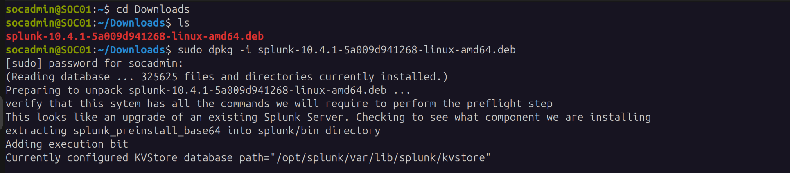

Installed to `/opt/splunk`.

## Step 3 — Verify Installation

```bash
ls /opt
# splunk
```

```bash
tree -L 1 /opt/splunk
```

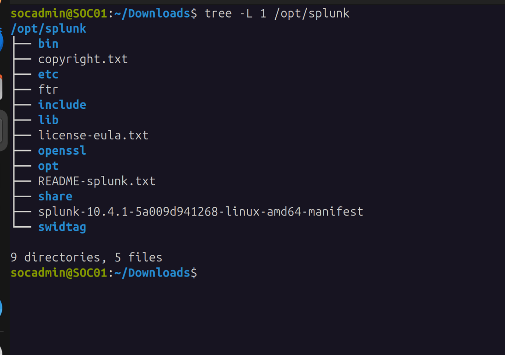

Splunk's install directory is the heart of the SIEM — this is where configuration, data, and logs all live going forward:

| Directory | Purpose |
|---|---|
| `/opt/splunk/bin` | Splunk commands (`splunk start`, `splunk status`, etc.) |
| `/opt/splunk/etc` | Configuration files (`inputs.conf`, `outputs.conf`, indexes, apps) |
| `/opt/splunk/var` | Indexed data and internal logs |

## Step 4 — Start Splunk (First Time)

```bash
sudo /opt/splunk/bin/splunk start --accept-license
```

First start displays the license, generates internal indexes and self-signed certificates, then prompts for the admin account.

## Step 5 — Create the Admin Account

Prompted for:

- **Administrator username:** `socadmin`
- **Password:** set during this step, not stored in the repo

The default admin account was kept for this lab, since that's standard practice for Splunk's initial administrator. Additional, more tightly scoped administrative users could be added later if the deployment needed hardening.

## Step 6 — Enable Splunk at Boot

```bash
sudo /opt/splunk/bin/splunk enable boot-start -user splunk
```
```
Init script installed at /etc/init.d/splunk.
Init script is configured to run at boot.
```

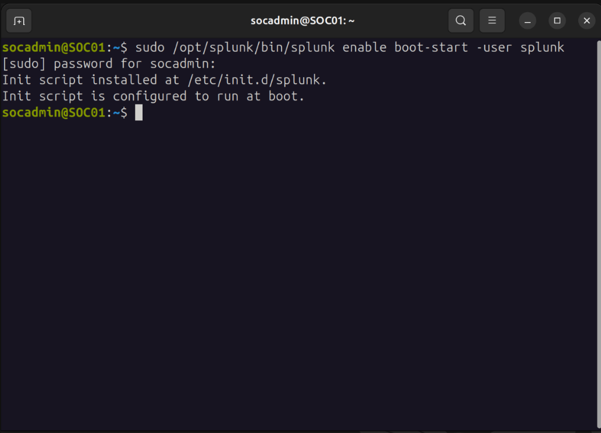

This registers Splunk as a system service so it comes back up automatically after a reboot, rather than depending on someone starting it manually.

## Step 7 — Web Interface

```
http://192.168.56.10:8000
```

Logged in as `socadmin`.

## Index creation

Before configuring receiving, the destination indexes need to exist. Splunk ships with a default `main` index, but that wasn't used here — three dedicated indexes were created instead.

**Navigation:** `Settings` (gear icon) → under **DATA** → `Indexes` → `New Index`

Direct URL: `http://192.168.56.10:8000/en-US/manager/search/data/indexes`

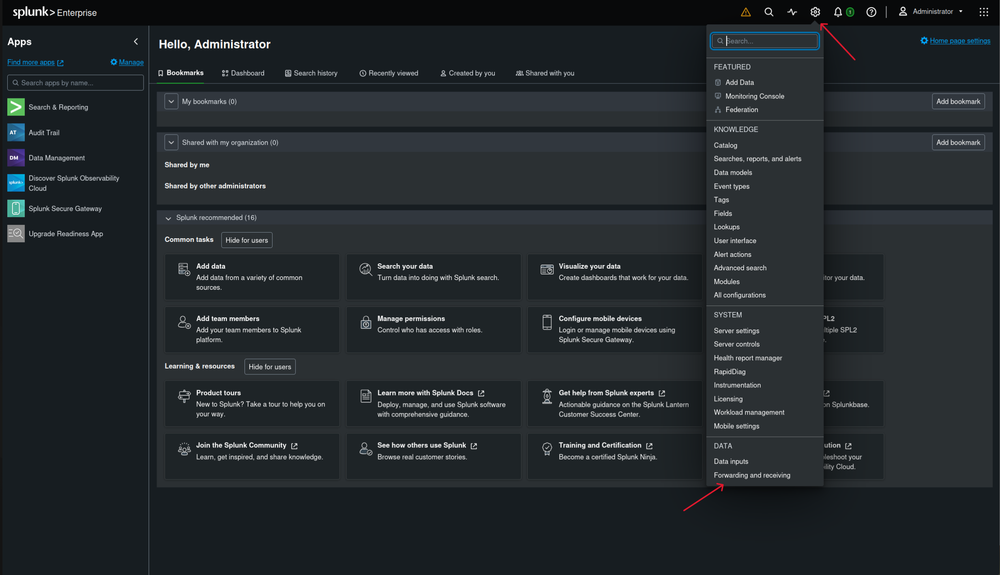
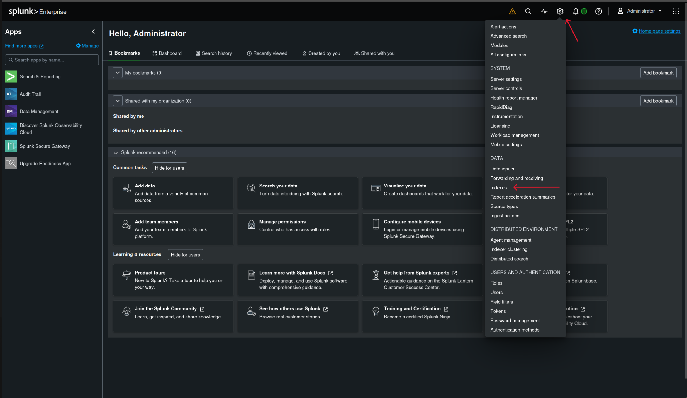

Create exactly three indexes: `sysmon`, `wineventlog`, `powershell`.

For each one, the form is mostly left at default — nothing exotic here. What actually needed setting:

- **Index name** — `sysmon` for the first pass, then repeated for `wineventlog` and `powershell`
- **Data integrity check** — set to **Enable** (Splunk computes hashes over every slice of ingested data, useful for verifying nothing was tampered with after the fact — relevant given this is security telemetry)
- Everything else — home path, cold path, thawed path, max size of entire index, max size of hot/warm/cold bucket — left at Splunk's defaults, which is fine for a single-node lab

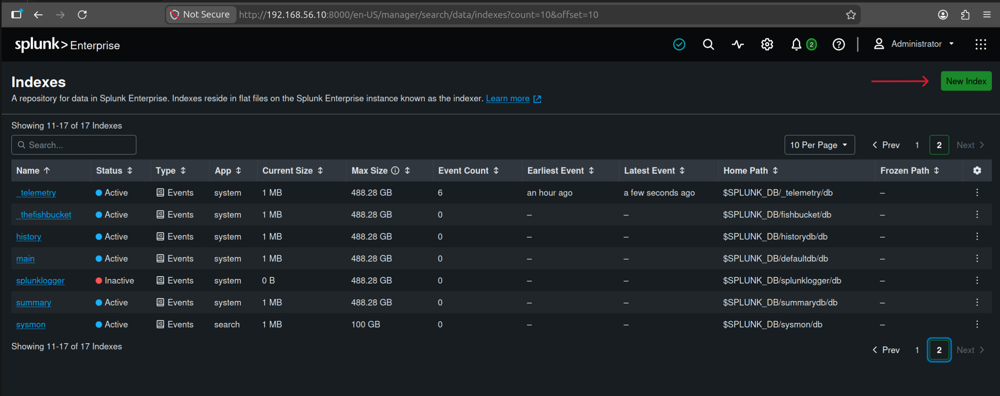
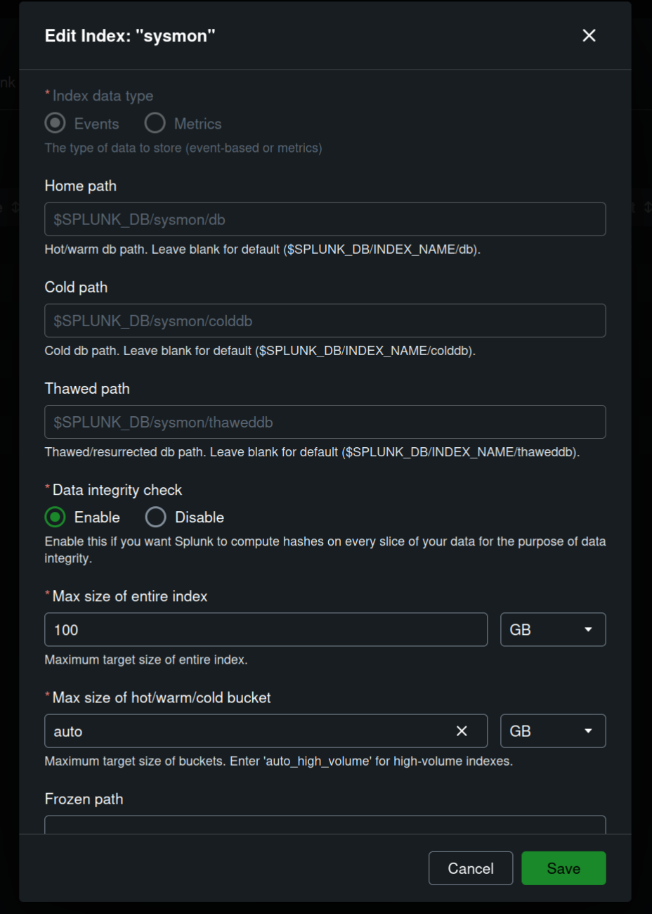

Same steps repeated for `wineventlog` and `powershell` — only the name changes, Data integrity check enabled, rest left default.

All three confirmed on disk:

```bash
sudo find /opt/splunk/var/lib/splunk -maxdepth 2 | grep -E 'sysmon|wineventlog|powershell'
```
```
/opt/splunk/var/lib/splunk/powershell
/opt/splunk/var/lib/splunk/powershell/thaweddb
/opt/splunk/var/lib/splunk/powershell/colddb
/opt/splunk/var/lib/splunk/powershell/db
/opt/splunk/var/lib/splunk/powershell/datamodel_summary
/opt/splunk/var/lib/splunk/sysmon
/opt/splunk/var/lib/splunk/sysmon/thaweddb
/opt/splunk/var/lib/splunk/sysmon/colddb
/opt/splunk/var/lib/splunk/sysmon/db
/opt/splunk/var/lib/splunk/sysmon/datamodel_summary
/opt/splunk/var/lib/splunk/wineventlog
/opt/splunk/var/lib/splunk/wineventlog/thaweddb
/opt/splunk/var/lib/splunk/wineventlog/colddb
/opt/splunk/var/lib/splunk/wineventlog/db
/opt/splunk/var/lib/splunk/wineventlog/datamodel_summary
```

### Why three separate indexes instead of `main`

Different telemetry sources carry different volume, retention, and sensitivity characteristics — `powershell` in particular can contain script block content with plaintext credentials, so it's kept isolated in case tighter access control is needed later. Splunk RBAC is index-scoped, not sourcetype-scoped, so a single combined index with sourcetype filtering would have made that kind of isolation impossible down the line.

This lab is a single-node deployment, but the index separation mirrors enterprise SIEM design and keeps future RBAC, retention, and data lifecycle changes straightforward instead of requiring a re-architecture later.

## Receiving port

**Navigation:** `Settings` → under **DATA** → `Forwarding and receiving` → `Configure receiving` → `Add new`


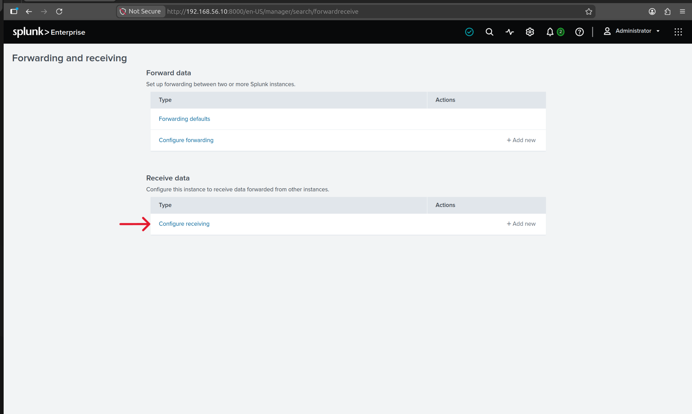
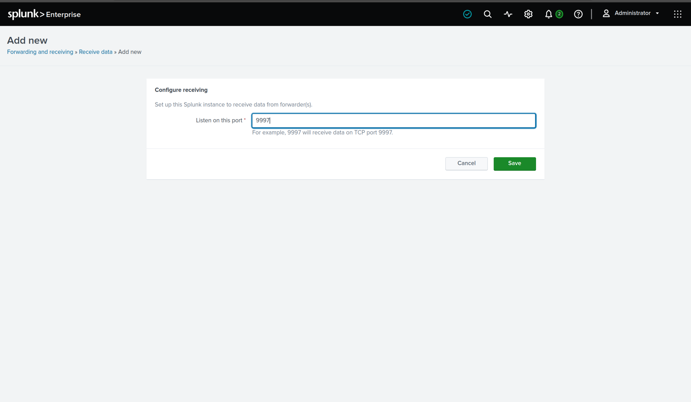

Set the listening port to `9997` and saved.

**Why 9997:** this is Splunk's standard indexer-receiving port — the port a Universal Forwarder sends data to by default. There's nothing special about the number itself, but sticking to convention means the Windows Universal Forwarder (set up in `04-windows-setup.md`) needs no non-standard configuration to find this indexer. Picking a different port would just be one more thing to remember and get wrong later.

Confirmed it's actually listening rather than just trusting the UI:

```bash
sudo ss -tulpn | grep 9997
```
```
tcp   LISTEN   0   128   0.0.0.0:9997   0.0.0.0:*   users:(("splunkd",pid=116961,fd=127))
```

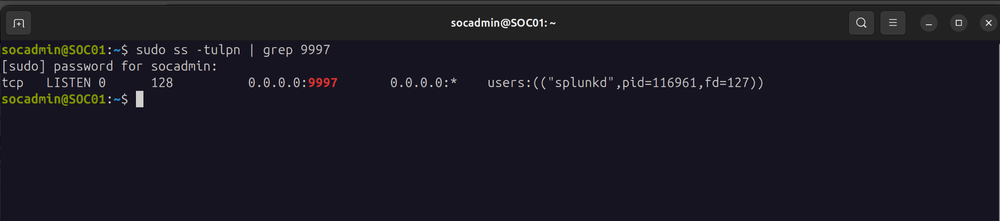

## Firewall

No host firewall was configured on SOC01 until this point — a real gap, since the architecture diagram already claimed UFW was scoping access to ports 22, 8000, and 9997.

```bash
sudo ufw allow 22/tcp
sudo ufw allow 8000/tcp
sudo ufw allow 9997/tcp
sudo ufw enable
sudo ufw status verbose
```
```
Status: active
Logging: on (low)
Default: deny (incoming), allow (outgoing), disabled (routed)

To              Action      From
--              ------      ----
22/tcp          ALLOW IN    Anywhere
8000/tcp        ALLOW IN    Anywhere
9997/tcp        ALLOW IN    Anywhere
22/tcp (v6)     ALLOW IN    Anywhere (v6)
8000/tcp (v6)   ALLOW IN    Anywhere (v6)
9997/tcp (v6)   ALLOW IN    Anywhere (v6)
```

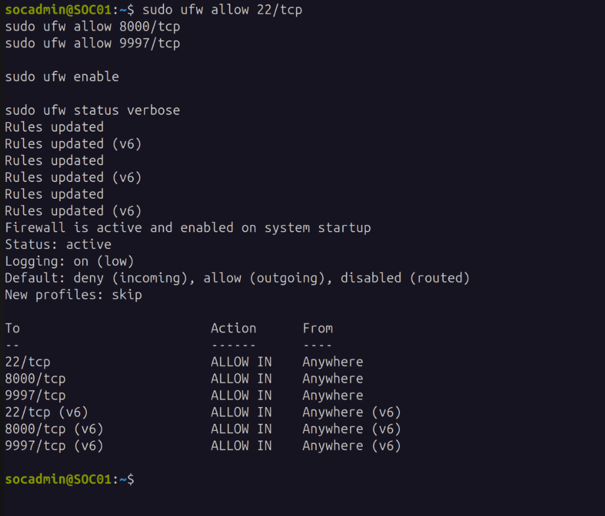

Default-deny on incoming traffic, with SSH, Splunk Web, and the receiving port explicitly allowed. Everything else on SOC01 is closed by default now, instead of relying on whatever isolation the host-only network happened to provide.

## TLS (deferred)

By default, traffic on port 9997 is plaintext. This is a deliberate sequencing choice, not an oversight: validating plain TCP connectivity first, end to end, means any connection problems get diagnosed without TLS as a second variable in the mix.

Splunk already generates self-signed certificates on first startup, which can serve as the starting point once TLS is actually configured. The plan is to enable TLS-related SSL settings on the receiver side in `inputs.conf`, with matching settings on the forwarder side in `outputs.conf` — done as one controlled step once the Windows Universal Forwarder is installed and forwarding cleanly, not folded into the same session as everything else here.

**For now:** port 9997 stays enabled without TLS. This gets revisited once plain connectivity from the forwarder is confirmed.

## Where this leaves things

Splunk Enterprise is installed, reachable on the web UI, listening for forwarded data on 9997, configured to survive a reboot, and sitting behind a default-deny firewall with only the necessary ports open. Three dedicated indexes (`sysmon`, `wineventlog`, `powershell`) are created and confirmed on disk. The one thing still open going into Phase 3 is TLS on the forwarder-to-indexer channel — deliberately deferred until plaintext connectivity is fully validated end to end, not an oversight.

## Next

Windows endpoint (`04-windows-setup.md` and `05-windows-telemetry.md`): audit policy, PowerShell logging, Sysmon, Universal Forwarder, then verify telemetry actually lands in Splunk.
