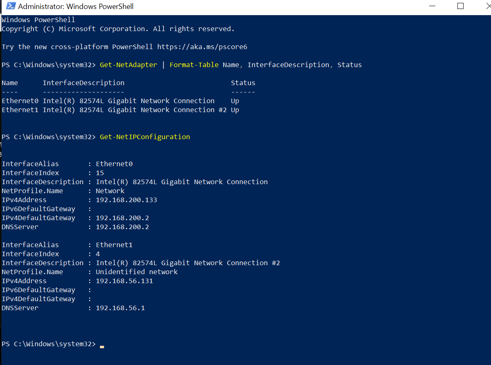
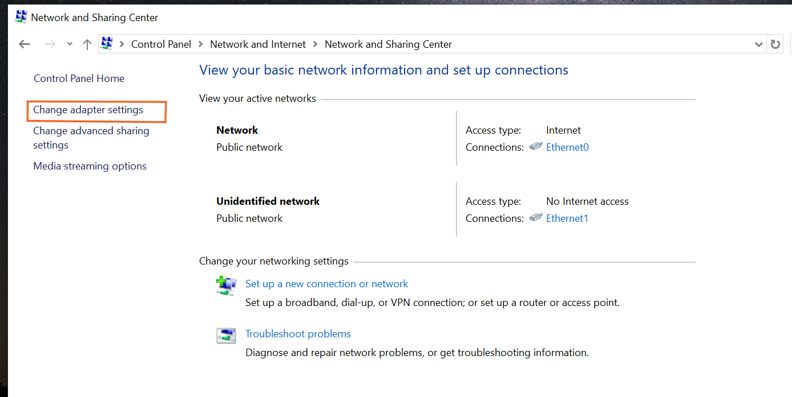
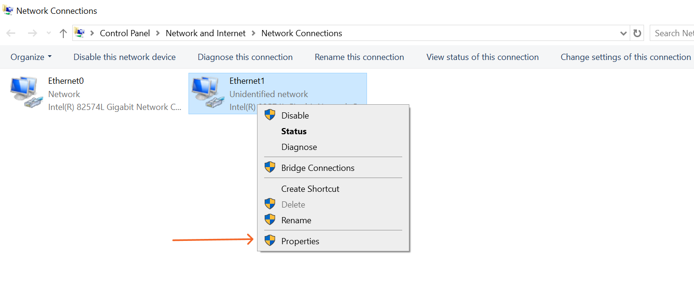
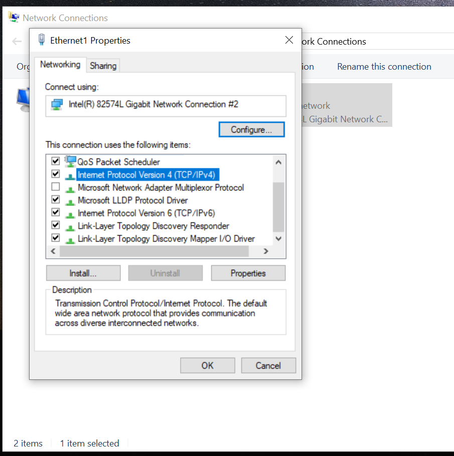
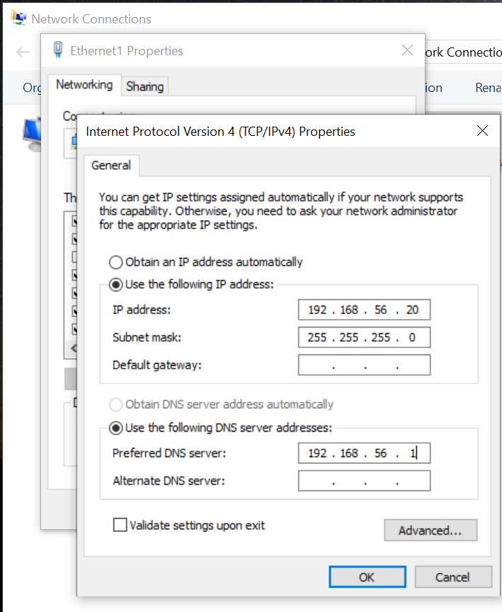
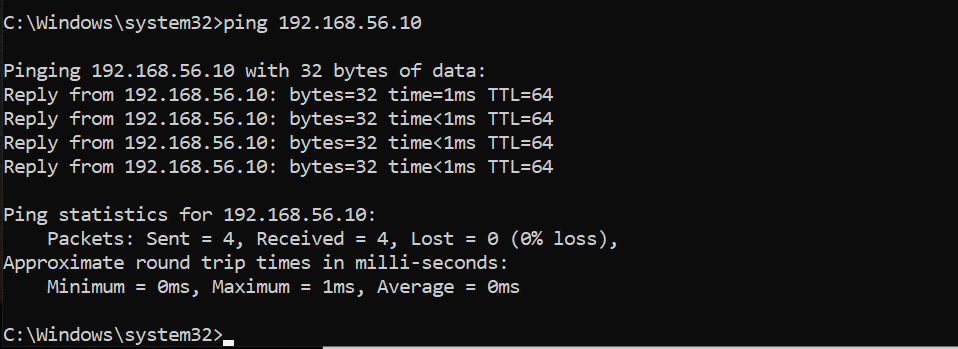
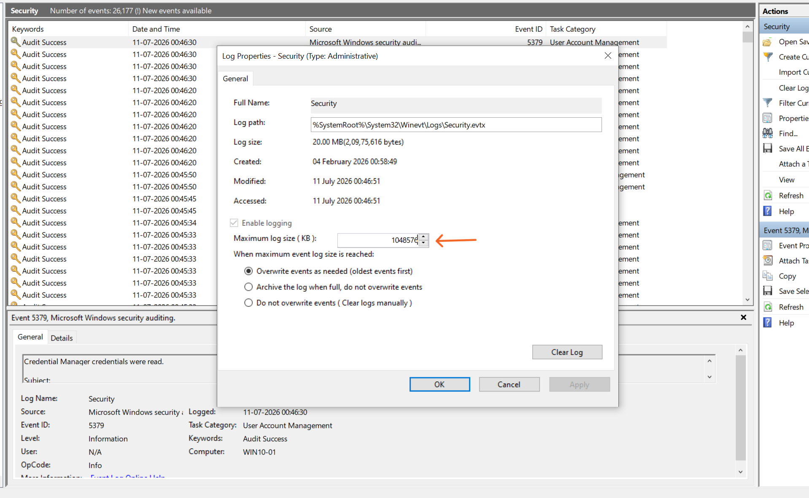
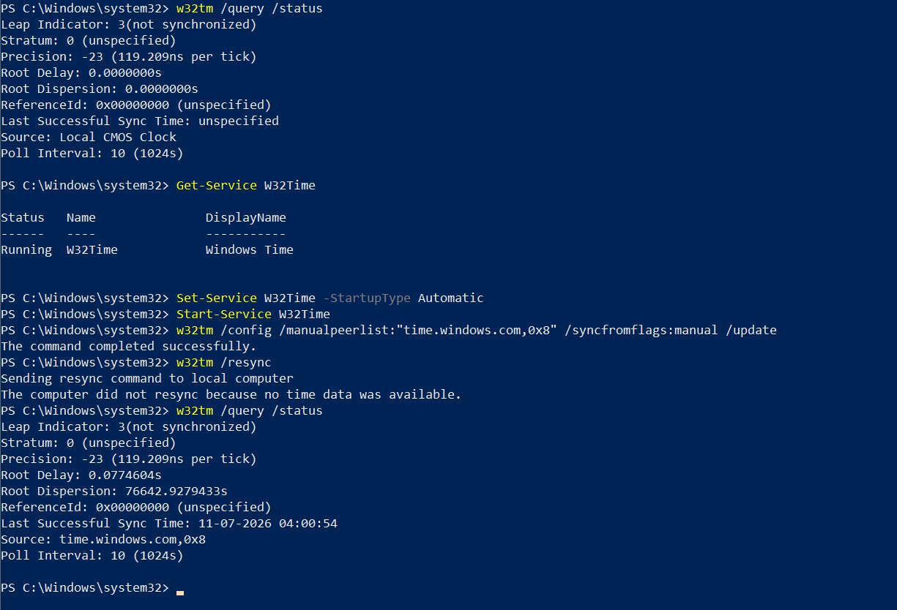

# Windows Endpoint Setup

**Status:** Complete
**Lab:** Splunk Detection Engineering Lab
**Updated:** 2026-07-17

This doc covers the OS-level prep for WIN10-01 — hostname, static networking, event log sizing, and time sync. Basically the Windows version of what I did for SOC01 in `02-ubuntu-soc-setup.md`: get the box into a known, stable state before touching anything telemetry-specific. Audit policy, PowerShell logging, Sysmon, and the Universal Forwarder come later in `05-windows-telemetry.md`.

## Machine info

| Component | Value |
|---|---|
| Hostname | WIN10-01 |
| OS | Windows 10 Pro |
| RAM | 8 GB |
| vCPU | 4 |
| Disk | 80 GB (NVMe) |
| Time zone | (UTC+05:30) Chennai, Kolkata, Mumbai, New Delhi |
| Network | Host-only (lab segment) + NAT (internet) |
| LAB IP | 192.168.56.20/24 |
| SOC server | 192.168.56.10 |

## Step 1 — Rename the computer

Default hostname was the usual `DESKTOP-XXXXXXXX`. Changed it to something meaningful so it's actually identifiable later in Splunk searches, investigations, and dashboards — same reasoning as the SOC01 rename back in `02-ubuntu-soc-setup.md`.

**Navigation:** `Settings → System → About → Rename this PC`

Set it to `WIN10-01`. Verified with:

```
hostname
```
```
WIN10-01
```

## Step 2 — Static network configuration

Same idea as SOC01: the host-only adapter gets a static IP so Splunk inputs and forwarder config don't break if a DHCP lease ever changes. NAT adapter stays on DHCP since that's just for internet access.

First step was figuring out which adapter was which, from PowerShell:

```powershell
Get-NetAdapter | Format-Table Name, InterfaceDescription, Status
Get-NetIPConfiguration
```



`Ethernet0` turned out to be the NAT adapter (internet). `Ethernet1` is the host-only one — that's the one that needed the static IP.

**Navigation:** `Control Panel → Network and Internet → Network and Sharing Center → Change adapter settings`



Right-click `Ethernet1` → `Properties`:



Select `Internet Protocol Version 4 (TCP/IPv4)` → `Properties`:



Configuration applied:

| Field | Value |
|---|---|
| IP address | 192.168.56.20 |
| Subnet mask | 255.255.255.0 |
| Default gateway | (left blank) |
| Preferred DNS | 192.168.56.1 |



Verified against SOC01:

```
ping 192.168.56.10
```
```
Packets: Sent = 4, Received = 4, Lost = 0 (0% loss)
```



## Step 3 — Event log sizing

Left at default, Windows log sizes are too small for what this lab needs — running Atomic Red Team tests repeatedly generates a lot of events, and the default caps mean early telemetry from a test session can get silently rolled over and lost before it ever makes it to Splunk. Bumped all four up front so this doesn't bite later.

| Log | Configured max size |
|---|---|
| Security | 1,048,576 KB (1024 MB) |
| Application | 524,288 KB (512 MB) |
| System | 524,288 KB (512 MB) |
| PowerShell Operational | 524,288 KB (512 MB) |

All four set to **Overwrite events as needed (oldest events first)**.

**Navigation (Security log, as an example):**

```
Event Viewer → Windows Logs → Security → right-click → Properties
```

Set **Maximum log size (KB)** to `1048576`, retention left on **Overwrite events as needed**.



The same steps apply to the other three logs, just with different paths and target sizes:

- **Application:** `Windows Logs → Application → Properties` → `524288` KB
- **System:** `Windows Logs → System → Properties` → `524288` KB
- **PowerShell Operational:** `Applications and Services Logs → Microsoft → Windows → PowerShell → Operational → Properties` → `524288` KB

## Step 4 — Time synchronization

Same reasoning as the NTP setup on SOC01 — Splunk correlates events by timestamp, so if WIN10-01 and SOC01 drift apart even slightly, correlation searches and investigation timelines start breaking in ways that are annoying to trace back to "oh, it was just clock drift."

Checked the starting state first, and it was unsynced, as expected on a fresh VM:

```powershell
w32tm /query /status
```
```
Leap Indicator: 3(not synchronized)
Source: Local CMOS Clock
```



Enabled and configured the Windows Time service to sync against `time.windows.com`:

```powershell
Set-Service W32Time -StartupType Automatic
Start-Service W32Time
w32tm /config /manualpeerlist:"time.windows.com,0x8" /syncfromflags:manual /update
```

**Hit a small snag right after this, worth mentioning since it's genuinely easy to run into:**

```powershell
w32tm /resync
```
```
The computer did not resync because no time data was available.
```

First reaction was "did I break something?" — but checking the status again right after actually showed a successful sync had already gone through in the background:

```
Last Successful Sync Time: 11-07-2026 04:00:54
Source: time.windows.com,0x8
```

So what actually happened: the peer had literally just been configured, and the `/resync` command was fired off before the service got a chance to reach out to it. Not a real failure, just bad timing between the config change and the resync attempt.

To be sure it wasn't a fluke, restarted the service and forced a clean resync:

```powershell
net stop w32time
net start w32time
w32tm /resync /rediscover
```
```
Sending resync command to local computer
The command completed successfully.
```


**Lesson learned:** running `/resync` immediately after pointing `w32tm` at a new peer can throw a "no time data was available" error just because the service hasn't caught up yet — it's not an actual sync problem. Waiting a few seconds and checking status again (or just re-running the resync) usually shows it worked fine.

Both SOC01 and WIN10-01 are now synced independently to real external time sources — `systemd-timesyncd` against Ubuntu's default NTP pool on SOC01, `time.windows.com` here. That's really what matters for keeping the two boxes within a few seconds of each other, not comparing their clocks directly.

## Where this leaves things

At this point WIN10-01 has a proper hostname, a static IP that matches the lab's network plan, log sizes big enough to survive repeated Atomic Red Team runs, and time sync that's actually working against an external source instead of free-running. Basically the same baseline SOC01 got in `02-ubuntu-soc-setup.md` — a stable starting point before layering on anything telemetry-specific, which is next up in `05-windows-telemetry.md`.
